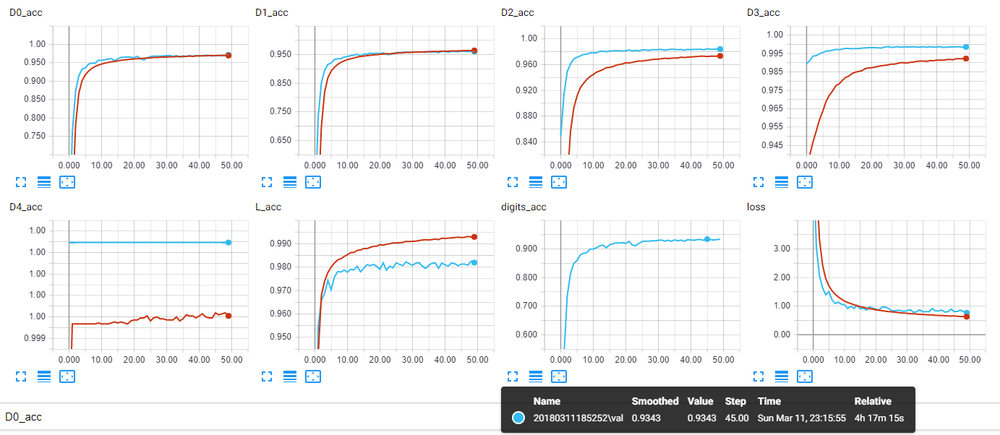

<h5>Keras implementation of  of <a href="http://arxiv.org/pdf/1312.6082.pdf">Multi-digit Number Recognition from Street View Imagery using Deep Convolutional Neural Networks</a></h5>
This implementation follows the paper's descriptions of the network, with a couple of differences.

* Conv2d layers use 3x3 kernel instead of 5x5
* Only one fully connected layer with 2048 units.

It reaches 93.43% after 45 epochs. The training time is about 2ms/step on 2xGTX1080.
