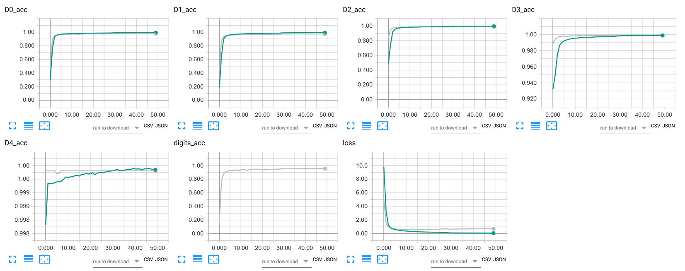

<h5>Keras implementation of  of <a href="http://arxiv.org/pdf/1312.6082.pdf">Multi-digit Number Recognition from Street View Imagery using Deep Convolutional Neural Networks</a></h5>
This implementation follows the paper's descriptions of the network, with one tweak:

* Removed num_digits output from model
* One LSTM layer replaced two fully connected layers

It reaches 95.5% after 50 epochs. The training time is 4h33m for 50 epochs on 2xGTX1080.
